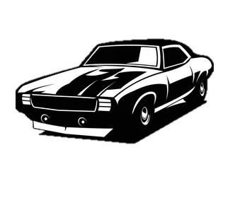
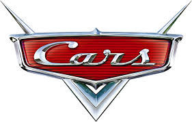

index.html  

<!DOCTYPE html>
<html lang="pt-br">
<head>
    <meta charset="UTF-8">
    <meta name="viewport" content="width=device-width, initial-scale=1.0">
    <title>inicio</title>
<link rel="stylesheet" type="text/css" href="css/index.css">

</head>
<body>
    

 

    

    <li> <a href="index.html">inicio</a> </li>

    <li><a href="pag2.html" >sobre mim</a></li>

    <li><a href="pag3.html">hobbies</a></li>

 

    

    

    

 

<h2 class="h2" ><strong>As principais marcas utilizadas de carro:</strong></h2>

<h3></h3>

A indústria automotiva desempenha um papel crucial na economia global, produzindo veículos que movem eficientemente pessoas e mercadorias dentro de países e por toda uma região. Essas empresas fabricam carros, caminhões, vans e veículos utilitários esportivos (SUVs), com algumas se aventurando na produção de motocicletas, veículos todo-terreno e veículos comerciais, como caminhões de transporte e ônibus.
 
 As maiores fabricantes de automóveis possuem uma presença global significativa, vendendo veículos para consumidores e empresas em todo o mundo. Aqui listamos algumas das maiores empresas automotivas do mundo.

 
 <h3 class="h3">• Toyota Motor Corp. </h3>
   
 

 <ul class="lista">Receita: $270,58 bilhões</ul>
 <ul class="lista"> Lucro líquido: $28,15 bilhões </ul>
 <ul class="lista">Ativos: $552,46 bilhões</ul>
 <ul class="lista">Valor de mercado: $237,73 bilhões </ul>

    
   
A Toyota (TM) é uma multinacional japonesa. Foi a primeira fabricante estrangeira a conquistar uma participação de mercado dominante no mercado automotivo dos EUA, estabelecendo o padrão da indústria para eficiência e qualidade. A Toyota projeta e fabrica carros, caminhões, minivans e veículos comerciais. Modelos de veículos incluem Corolla, Camry, 4Runner, Tacoma e o híbrido elétrico Prius. A Lexus é a divisão de carros de luxo da empresa. A Toyota também produz peças e acessórios e fornece financiamento para concessionárias e clientes. 
 
     

   --------------------------

   <h3 class="h3">• Grupo Volkswagen</h3>

   

   <ul class="lista">Receita: $295,73 bilhões</ul>
   <ul class="lista">Lucro: $17,54 bilhões</ul>
   <ul class="lista">Ativos: $638,26 bilhões</ul>
   <ul class="lista">Valor de mercado: $82,4 bilhões</ul>

A Volkswagen é uma empresa multinacional alemã de manufatura automotiva que desenvolve e produz carros de passageiros, caminhões e veículos comerciais leves, como ônibus. Modelos de veículos incluem Tiguan, Golf, Jetta, Passat e outros. A empresa interrompeu a produção do popular compacto Volkswagen Beetle no ano passado devido à queda na demanda por carros menores. As marcas de luxo mais conhecidas da Volkswagen são Porsche e Audi. A empresa também fabrica peças e oferece serviços de financiamento ao cliente e gerenciamento de frotas.

  

---------------------------

<h3 class="h3">• Mercedes Benz </h3>

<ul class="lista">Receita: $178,94 bilhões</ul>
<ul class="lista">Lucro: $27,19 bilhões</ul>
<ul class="lista">Ativos: $295,48 bilhões</ul>
<ul class="lista">Valor de mercado: $74,62 bilhões </ul>

A Mercedes-Benz, renomada montadora alemã, personifica a excelência automotiva com uma herança que remonta a 1926. Reconhecida por sua fusão incomparável de elegância e desempenho, a marca oferece uma gama de carros de passageiros que encapsulam a sofisticação alemã. Além disso, a Mercedes-Benz destaca-se por suas inovações tecnológicas de ponta, incorporando sistemas avançados de assistência ao motorista e proporcionando uma experiência de condução única. Não apenas líder no luxo automotivo, a Mercedes-Benz também abrange veículos comerciais, como vans, veículos todo-terreno e caminhões, solidificando sua posição como uma das principais influências no cenário global da indústria automotiva.

------------------------

<h3 class="h3">• Ford Motor Co.</h3>

Receita: $136,34 bilhões

Ativos: $257,04 bilhões
Valor de mercado: $60,8 bilhões
<h3><ul>
Receita: $136,34 bilhões
</ul></h3>
<h3><ul>
Lucro: $17,94 bilhões
</ul></h3>
<h3><ul>
Ativos: $295,48 bilhões
</ul></h3>
<h3><ul>
Valor de mercado: $74,62 bilhões  
</ul></h3>

 
A Ford, gigante multinacional com sede em Michigan, é uma força motriz na indústria automotiva global. Com uma rica história que remonta ao início do século XX, a empresa não apenas desenvolve e fabrica uma ampla variedade de veículos, incluindo carros, SUVs, vans e caminhões, mas também é reconhecida por seus modelos emblemáticos que capturam a imaginação dos consumidores. Entre eles estão ícones como o Mustang, símbolo de potência e elegância, o versátil SUV Edge, o prático e eficiente Escape, o lendário F-150 e a robusta Ranger. Além de sua excelência na engenharia automotiva, a Ford também se destaca ao oferecer soluções financeiras abrangentes, incluindo financiamento e leasing, ampliando sua presença para além da fabricação de veículos e solidificando sua posição como uma das líderes no setor automotivo mundial.

-----------------------

5. Grupo BMW
Receita: $131,48 bilhões
Lucro: $14,64 bilhões
Ativos: $277,28 bilhões
Valor de mercado: $55,98 bilhões

A BMW, sediada na Baviera, Alemanha, é uma fabricante automotiva multinacional de prestígio que personifica a elegância e o desempenho refinado. Reconhecida por sua herança de excelência alemã, a BMW projeta, desenvolve e fabrica uma variedade de veículos de luxo, incluindo carros esportivos, sedans, SUVs e veículos elétricos. Entre seus modelos distintivos estão o BMW Série 3, um ícone entre os sedans de luxo, o SUV X5, que combina versatilidade e sofisticação, e o inovador i3, um veículo totalmente elétrico. Além desses, a BMW também é conhecida por seus modelos de alto desempenho, como o M3 e o M5, que incorporam engenharia de precisão e design aerodinâmico. Com uma abordagem centrada no motorista e um compromisso inabalável com a qualidade, a BMW permanece na vanguarda da indústria automotiva global, oferecendo uma experiência de condução exclusiva e distintiva.

  
</body>
</html>

index.css

#jump2{

    width: 400px;
    height: 140px;
    background-color: rgb(255, 255, 255);
 
    top: 0;
    left: 0;
    opacity: 60%;

}

.h2 {

      /* text-align: center;  */

      /* centralizar o a palavra, o tema o que vc for selecionar */
font-size: 40px;
font-family: Arial, Helvetica, sans-serif;
text-align: center;

}

li{

display: inline-flex;
padding: 10px;

}

li a{
text-decoration: none;
font-family: Arial, Helvetica, sans-serif;
font-weight: bold;
color: black;
transition: all 0.5s;
top: 10%;

}

li a:hover{
    
    background-color: white;
}

.pedrinho{
   
    border: 2px solid black ;
    font-family: Arial, Helvetica, sans-serif;
    font-size: 24px;
    color: rgb(0, 0, 0);
    background-color: Gray;
    top: 
    padding 5px;
    
    display: flex;
    flex-direction: row;
    justify-content: start;
    align-items: center;
 }

    #jesus{
inline-size: 60px;

    }

    .paragrafo{

font-family: Arial, Helvetica, sans-serif;
margin: 40px;
font-size: 26px;

    }

    #carros{
height:350px;
width: 500px;
margin-left: 550px;
    }

    .h3{
        font-family: Arial, Helvetica, sans-serif;
        font-size: 26px;
        margin-left: 85px;
color: rgb(0, 0, 0, 125);
border: 20px;
border-radius: 20px;
background-color: gray;
padding: 10px;
width: 450px;
    }

    #toyota{
        margin-left: 270px;
        border: 20px;
        border-radius: 20px;
    }

/*body{

    background-color: silver;

}*/

#volkswagen{

    height:390px;
    width: 700px;
    margin-left: 400px;
    border: 20px;
    border-radius: 20px;

}

.lista{
font-size: 24px;

}

